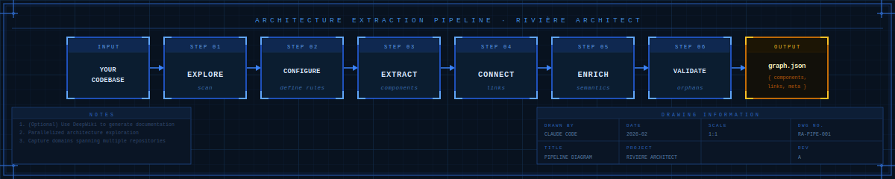

<p align="center">
  
</p>

# Rivière Architect

A Claude Code plugin that reverse-engineers existing codebases into structured, queryable architecture graphs using [Rivière](https://living-architecture.dev).

Point it at one or more repositories and it produces a complete component graph — APIs, use cases, domain operations, events, and the links between them — ready to query, visualize, or use for impact analysis.

## What It Does

<p align="center">
  
</p>

The extraction workflow runs in 6 coordinated steps. Each step spawns parallel subagents across repositories while serializing all graph writes to prevent corruption.

### The 6 Steps

| Step | Phase         | What Happens                                                                                |
| ---- | ------------- | ------------------------------------------------------------------------------------------- |
| 1    | **Explore**   | Scan repositories for structure, conventions, domain boundaries, and module inference rules |
| 2    | **Configure** | Define component extraction patterns and linking rules per type and repository              |
| 3    | **Extract**   | Find and stage all components (APIs, UseCases, DomainOps, Events, EventHandlers, UI)        |
| 4    | **Connect**   | Trace operational links between components — sync HTTP calls and async event flows          |
| 5    | **Enrich**    | Add semantic detail to DomainOps — state changes, business rules, operation behavior        |
| 6    | **Validate**  | Check for schema compliance and resolve orphaned components                                 |

## Key Design Decisions

- **Domains are not repositories.** A single business domain often spans multiple repos. The canonical domain registry (`domains.md`) prevents structural graph errors.
- **User confirmation gates.** Domain names propagate through the entire graph. Steps 1-2 require explicit user approval before downstream work begins.

## Installation

```bash
# Add the marketplace
/plugin marketplace add adamNewell/claude-skills

# Install the plugin
/plugin install riviere-architect --scope project
```

### Prerequisites

- [Rivière CLI](https://www.npmjs.com/package/@living-architecture/riviere-cli): `npm install -g @living-architecture/riviere-cli`
- [Bun](https://bun.sh) runtime

## Usage

Invoke the skill by asking Claude to extract architecture from a codebase:

```
Extract the architecture from this repository
```

```
Map the architecture across these three services: orders-api, payments-service, inventory-worker
```

For wiki-augmented extraction (richer context for agents):

```
Extract architecture from this repo using the wiki at ./wiki/
```

## What You Get

The output is a structured JSON graph at `.riviere/[project]-[commit].json` containing:

- All discovered components by type and domain
- Operational links (sync and async) between components
- Semantic enrichment on domain operations
- Full source file traceability (file path + line number)

### After Extraction

| Goal            | How                                                                  |
| --------------- | -------------------------------------------------------------------- |
| Query the graph | `npx riviere query`                                                  |
| Visualize       | Upload to [living-architecture.dev](https://living-architecture.dev) |
| Impact analysis | Query upstream/downstream component chains                           |
| Onboarding      | Share the graph — navigate the system without reading code           |

## Plugin Contents

```
riviere-architect/
├── skills/
│   └── extract-architecture/     # Core extraction workflow
│       ├── SKILL.md              # Entry point and routing
│       ├── steps/                # 14 orchestrator + subagent instructions
│       └── tools/                # 9 TypeScript automation tools
├── agents/                       # Specialized staging agents
├── commands/                     # Slash commands
├── cookbook/                      # CLI reference (riviere, qmd)
└── hooks/                        # Lifecycle hooks
```

## License

MIT
